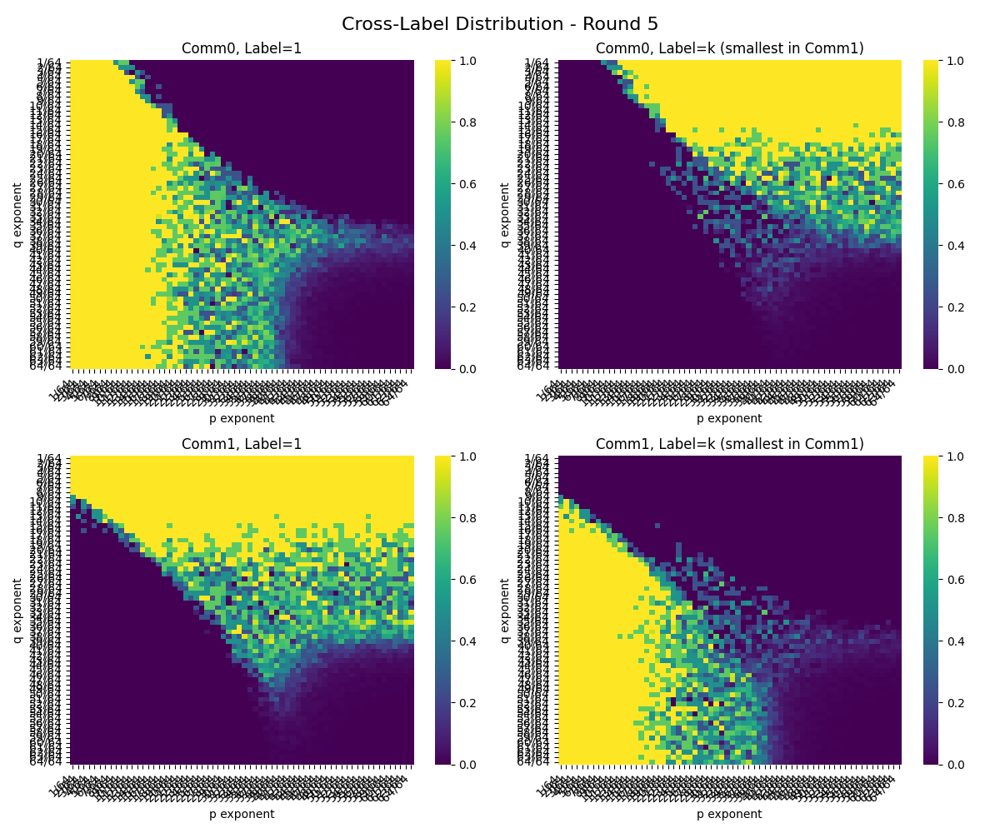

# Label Propagation in a 2-Community Stochastic Block Model

This repository contains code for generating and analyzing parameter space diagrams of the label propagation algorithm on a 2-community SBM (Stochastic Block Model). It includes:

1. **Efficient, parallelizable** data generation scripts (C++, but a serial version is also provided in Python).
2. **Heatmap visualizations** of the fraction of nodes converging to correct labels under various $(p, q)$ regimes.
3. **Example plots** that demonstrate phase transitions and other interesting phenomena in the label propagation process.

Written by [Sophia Pi](https://www.linkedin.com/in/sophia-yixinyun-pi) under the supervision and mentorship of Prof. [Miklos Racz](https://racz.statistics.northwestern.edu/) and [Shuwen Chai](https://shuwenchai.github.io/) for an undergraduate research project at Northwestern University.

---

## Contents

- **`run_lpa_experiment.py`**  
  A command-line tool that generates SBMs, runs label propagation, collects statistics, and plots the resulting heatmaps.

- **`plots/`**
  Example figures generated by the script, showing parameter space diagrams of convergence properties across different $(p, q)$ values.

- **`requirements.txt`**  
  Standard pip requirements file listing Python package dependencies.

---

## Background

This repository runs simulations of the label propagation algorithm (LPA) on balanced 2-community SBMs.

#### SBM Parameters

- $n$: Number of nodes in the SBM.
- $p$: Probability of an edge between two nodes in the same community.
- $q$: Probability of an edge between two nodes in different communities.

For the purposes of this analysis, we consider $p = n^{-i/k}$ and $q = n^{-j/k}$, where $i, j \in [0, k]$ and $k$ = `num_params`.

#### LPA Algorithm Pseudocode

1. Initialize labels:  
   - For the first round, each node adopts the smallest label among its neighbors, including itself.  
     (Because each node initially has a unique label, any node originally labeled "1" will remain labeled "1".)

2. Iterative update:
   - For each subsequent round, simultaneously update the labels of all nodes:
     1. For every node u, look at the labels of its neighbors (including u's own label from the previous round).  
     2. Determine the most frequent label among those neighbors.  
     3. If there is a tie for the most frequent label, choose the smaller label.  
     4. Assign that label to u for round t.

---

## Setup & Installation

1. **Clone** this repository:
   ```bash
   git clone https://github.com/sophiapi-nu26/label-propagation.git
   cd label-propagation-sbm
   ```

2. **Install** Python dependencies:
   ```bash
   pip install -r requirements.txt
   ```
   We recommend creating a new virtual environment using `conda` or `venv`.

3. **Run** the script to see help on available arguments:
   ```bash
   python run_lpa_experiment.py --help
   ```

---

## Usage

```bash
python run_lpa_experiment.py \
  --num_params 32 \
  --n 1000 \
  --rounds 5 \
  --trials 4 \
  --num_cores 2 \
  --prop conv_smallest_in_comm \
  --prop conv_smallest_global \
  --prop fraction_not_changed
```

- `--num_params`: Default: 32. Defines the grid size. The script will create a `num_params` x `num_params` grid of $(p, q)$ values. Column $i$, row $j$ corresponds to SBM($n$, $p$, $q$) where $p = n^{-i/k}$, $q = n^{-j/k}$, and $k$ = `num_params`.
- `--n`: Default: 1000. Number of nodes in the SBM (graph size).
- `--rounds`: Default: 5. Number of rounds of label propagation.
- `--trials`: Default: 4. Number of independent trials (SBM realizations) to average over for each $(p, q)$ pair.
- `--num_cores`: Default: 2. Number of CPU cores to run in parallel.
- `--prop`: Properties to track (repeatable). By default, if none are specified, the code tracks all of the following:
  - `conv_smallest_in_comm`: (2 plots, one per community). Fraction of nodes with the smallest label *originally assigned to the given community* after the given round.
  - `conv_smallest_global`: (2 plots, one per community). Fraction of nodes with the smallest community in the global network (i.e. label $1$) after the given round.
  - `fraction_not_changed`: (2 plots, one per community). Fraction of nodes that did not change their labels during the given round.

The `Cross-Label Distribution` property is always tracked. This generates a set of 4 heatmaps per round, tracking the fraction of nodes in community $i$ with label $l(j)$ after the given round for $i, j \in \{0, 1\}$.

Running the script will generate a set of plots in the current directory using the naming convention `{property}_round_{round}.png`.

---

## Interpreting the Plots

The plots are of various properties of the label propagation algorithm applied to a balanced 2-community SBM($n$, $p$, $q$) over the $(p, q)$ parameter space. 

The generated heatmaps have:
- x-axis: $-\log_n(p)$
- y-axis: $-\log_n(q)$
- color-scale: Fraction of nodes with the given property, averaged over `trials` trials.

---

## Example Plots



Example plots are in the `plots/` directory. The image above is an example of the `Cross-Label Distribution` property after round 5, generated with the parameters below (the same parameters used to generate all plots in `plots/`).

```bash
python run_lpa_experiment.py \
  --num_params 64 \
  --n 5000 \
  --rounds 8 \
  --trials 4 \
  --num_cores 10 \
  --prop conv_smallest_in_comm \
  --prop conv_smallest_global \
  --prop fraction_not_changed
```

## C++ Implementation

In addition to the Python implementation, this repository includes a C++ version (`label_prop_sbm.cpp`) that offers improved performance for large-scale simulations.

### C++ Setup & Requirements

1. **Compiler Setup** (choose one):
   - **Option 1: MinGW-w64** (Recommended for Windows):
     1. Download and install MinGW-w64 from [https://winlibs.com/](https://winlibs.com/)
     2. Add the `bin` directory to your system PATH
     3. Build using:
        ```bash
        g++ -O3 -fopenmp -std=c++17 label_prop_sbm.cpp -o label_prop_sbm.exe
        ```

   - **Option 2: Visual Studio**:
     1. Install Visual Studio Community Edition with "Desktop development with C++"
     2. Open Developer Command Prompt
     3. Navigate to the project directory
     4. Build using the Visual Studio compiler

2. **VSCode Setup** (Optional but recommended):
   - Install the "C/C++ Extension Pack" from Microsoft
   - Configure IntelliSense to use your installed compiler

3. **Running the Program**:
   ```bash
   # From command prompt or PowerShell
   label_prop_sbm.exe [N] [minalpha] [maxalpha] [minbeta] [maxbeta] [iterations] [trials] 
   ```

   Command line arguments (all optional):
   - `N`: Number of nodes (default: 10000)
   - `minalpha`: Minimum exponent for p = N^alpha (default: -1.0)
   - `maxalpha`: Maximum exponent for p = N^alpha (default: 0.0)
   - `minbeta`: Minimum exponent for q = N^beta (default: -1.0)
   - `maxbeta`: Maximum exponent for q = N^beta (default: 0.0)
   - `iterations`: Number of label propagation rounds (default: 10)
   - `trials`: Number of independent trials to average over (default: 4)

   Example:
   ```bash
   # Run with 50000 nodes, alpha in [-0.5,0], beta in [-0.5,0], 8 iterations, 2 trials
   label_prop_sbm.exe 50000 -0.5 0 -0.5 0 8 2
   ```

The program will create a timestamped results folder containing:
- Parameter log file
- CSV files for each tracked property per iteration
- Heatmaps showing the convergence properties across the (p,q) parameter space

Note: The C++ version uses OpenMP for parallelization. Make sure your chosen compiler supports OpenMP for optimal performance.

## Plotting Results

After running either the Python or C++ version, you can generate heatmap visualizations from the CSV files using the provided plotting script:

```bash
# For results from a specific run:
python generate_heatmaps.py --run_folder results/run_YYYYMMDD_HHMMSS

# Example:
python generate_heatmaps.py --run_folder results/run_20240315_143022
```

This will generate (for each property and for each round):
- Two side-by-side heatmaps for `conv_smallest_in_comm` (one per community)
- Two side-by-side heatmaps for `conv_smallest_global` (one per community)
- Two side-by-side heatmaps for `fraction_not_changed` (one per community)
- A 2x2 grid of heatmaps for the cross-label distribution

The heatmaps will be saved in their respective subfolders within the run directory, using the naming convention `{property}_round_{round}.png`.


